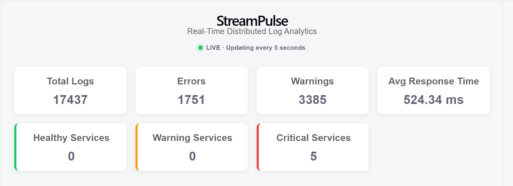
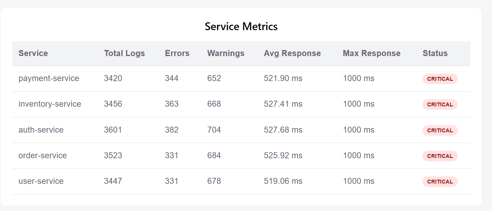
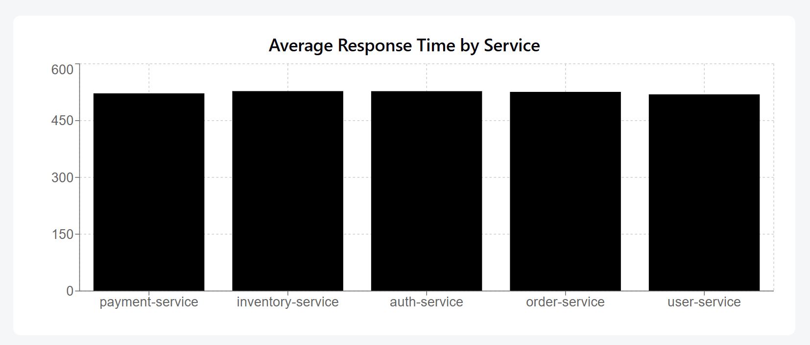
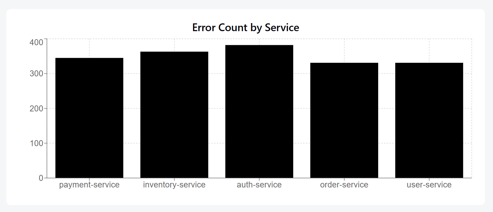

# StreamPulse — Real-Time Distributed Log Analytics & Monitoring Platform

> A cloud-deployed, real-time log analytics platform that ingests application logs through Kafka, processes them using Spark Structured Streaming, stores service-level metrics in Astra DB, and delivers live monitoring updates through FastAPI, WebSockets, and React.

## 🚀 Live Demo

**Live Dashboard:**  
http://65.0.32.253:5173

## 📌 Overview

Modern distributed applications generate large volumes of logs across multiple services. Processing these logs manually or through periodic batch jobs makes it difficult to identify errors, monitor response times, and understand the current health of services.

**StreamPulse** addresses this problem through a real-time event-driven pipeline.

Application logs are continuously generated, published to Kafka, processed using Spark Structured Streaming, aggregated into service-level metrics, persisted in a Cassandra-compatible cloud database, and delivered to a live monitoring dashboard.

### Core Pipeline

```text
Python Log Generator
        │
        ▼
   Aiven Kafka
        │
        ▼
Spark Structured Streaming
        │
        ▼
   DataStax Astra DB
        │
        ▼
      FastAPI
        │
        ▼
    WebSocket
        │
        ▼
 React Dashboard
```

## 🏗️ System Architecture

```text
Python Log Generator
        │
        ▼
   Aiven Kafka
        │
        ▼
Spark Structured Streaming
        │
        ▼
DataStax Astra DB
        │
        ▼
      FastAPI
        │
        ▼
    WebSocket
        │
        ▼
 React Dashboard
```

### Cloud vs Application Components

```text
                         AWS EC2
                    ┌─────────────────┐
                    │     Docker      │
                    │                 │
                    │ Python Producer │
                    │ Spark Streaming │
                    │ FastAPI         │
                    │ React           │
                    └────────┬────────┘
                             │
              ┌──────────────┴──────────────┐
              ▼                             ▼
       Aiven Kafka ☁️                Astra DB ☁️
```

## ☁️ Cloud Deployment Architecture

StreamPulse is deployed on an **AWS EC2** instance using Docker Compose.

### Deployment Components

| Component        | Deployment                  |
| ---------------- | --------------------------- |
| Log Producer     | Docker container on AWS EC2 |
| Spark Streaming  | Docker container on AWS EC2 |
| FastAPI          | Docker container on AWS EC2 |
| React            | Docker container on AWS EC2 |
| Kafka            | Aiven managed cloud service |
| Database         | DataStax Astra DB           |
| Containerization | Docker                      |
| Orchestration    | Docker Compose              |
| Compute          | AWS EC2                     |

### Deployment Flow

```text
GitHub Repository
       │
       ▼
    AWS EC2
       │
       ▼
 Docker Compose
       │
 ├── Producer
 ├── Spark
 ├── FastAPI
 └── React
       │
       ├──────────────► Aiven Kafka
       │
       └──────────────► Astra DB
```

## 🛠️ Tech Stack

| Technology | Purpose |
|---|---|
| **Python** | Log generation and streaming development |
| **Apache Kafka** | Real-time event streaming |
| **Aiven Kafka** | Managed cloud Kafka cluster |
| **Apache Spark** | Distributed stream processing |
| **Spark Structured Streaming** | Continuous Kafka stream processing |
| **DataStax Astra DB** | Managed Cassandra-compatible cloud storage |
| **Apache Cassandra** | Database technology and data model |
| **FastAPI** | REST API and WebSocket backend |
| **React** | Real-time monitoring dashboard |
| **WebSocket** | Live metric updates |
| **Docker** | Containerization |
| **Docker Compose** | Multi-container orchestration |
| **AWS EC2** | Cloud compute and deployment |
| **Git / GitHub** | Version control and project hosting |

## ✨ Features

### Real-Time Log Generation

The Python producer continuously generates application logs for multiple services.

### Monitored Services

- `auth-service`
- `payment-service`
- `user-service`
- `order-service`
- `inventory-service`

### Supported Log Levels

- `INFO`
- `WARN`
- `ERROR`

Each generated event contains:

```json
{
  "timestamp": "2026-10-03T08:00:00+00:00",
  "service": "payment-service",
  "level": "ERROR",
  "message": "Payment processing failed",
  "status_code": 500,
  "response_time_ms": 842
}
```

## 📡 Kafka Streaming

Apache Kafka acts as the event streaming layer between the log generator and Spark Structured Streaming.

The project uses **Aiven Kafka**, a managed cloud Kafka service.

### Kafka Topic

```text
application-logs
```

The topic uses multiple partitions to allow parallel processing of incoming events.

```text
Producer
   │
   ▼
Aiven Kafka
   │
   ├── Partition 0
   │
   └── Partition 1
   │
   ▼
Spark Structured Streaming
```

Kafka decouples the log producer from the downstream stream-processing system.

The producer and Spark Streaming authenticate with Aiven Kafka using secure **SASL/SSL** connections.

## ⚡ Spark Structured Streaming

Spark Structured Streaming continuously consumes log events from Kafka.

### Streaming Pipeline

1. Reads events from Kafka
2. Parses the JSON log structure
3. Converts fields into appropriate data types
4. Groups logs by service
5. Calculates service-level metrics
6. Writes aggregated metrics to Astra DB

### Service Metrics

StreamPulse calculates:

- Total logs
- Error count
- Warning count
- Average response time
- Maximum response time
- Event timestamp

### Example

```text
Service: payment-service

Total Logs:       325
Errors:            29
Warnings:          74
Avg Response:   545.20 ms
Max Response:  1000 ms
```

Spark Structured Streaming uses checkpointing to maintain streaming state and processing progress.

## ☁️ DataStax Astra DB

StreamPulse uses **DataStax Astra DB**, a managed cloud database based on Apache Cassandra, to persist aggregated service metrics.

### Keyspace

```text
streampulse
```

### Table

```text
service_metrics
```

### Table Structure

| Column | Type | Description |
|---|---|---|
| `service` | text | Service name |
| `event_time` | timestamp | Metric event timestamp |
| `total_logs` | int | Total logs processed |
| `error_count` | int | Number of ERROR logs |
| `warn_count` | int | Number of WARN logs |
| `avg_response_time` | double | Average response time |
| `max_response_time` | int | Maximum response time |

### Primary Key

```text
PRIMARY KEY (service, event_time)
```

## 🔌 FastAPI Backend

FastAPI provides the backend API layer between Astra DB and the React frontend.

### API Endpoints

#### Health Check

```http
GET /health
```

#### All Service Metrics

```http
GET /metrics
```

#### Service-Specific Metrics

```http
GET /metrics/{service}
```

Example:

```http
GET /metrics/payment-service
```

### WebSocket

```text
/ws
```

The React dashboard connects to this endpoint to receive live metric updates.

## 📊 React Dashboard

The React frontend provides a real-time monitoring interface.

### Dashboard Displays

- Total Logs
- Total Errors
- Total Warnings
- Average Response Time
- Warning Services
- Critical Services
- Per-service metrics
- Service health status
- Live update status

### Real-Time Communication

```text
FastAPI
   │
   │ WebSocket
   ▼
React Dashboard
   │
   └── Live metric updates
```

## 🟢 Service Health Status

StreamPulse derives a service status from its error and warning metrics.

### Current Classification Logic

```text
Error Count >= 10
       │
       ▼
   CRITICAL
```

```text
Warnings or Errors
       │
       ▼
   WARNING
```

```text
No Warnings or Errors
       │
       ▼
   HEALTHY
```

## 🐳 Docker Architecture

The current Docker Compose stack contains:

- `streampulse-spark`
- `streampulse-spark-streaming`
- `streampulse-producer`
- `streampulse-backend`
- `streampulse-frontend`

Kafka and Astra DB are managed cloud services rather than local Docker containers.

Docker Compose manages:

- Container creation
- Local networking
- Port mappings
- Environment variables
- Service dependencies
- Health checks
- Restart policies

## 📁 Project Structure

```text
streampulse/
│
├── backend/
│   ├── Dockerfile
│   ├── main.py
│   └── requirements.txt
│
├── frontend/
│   ├── Dockerfile
│   ├── package.json
│   └── src/
│
├── infrastructure/
│   └── docker-compose.yml
│
├── producer/
│   ├── Dockerfile
│   ├── log_generator.py
│   └── requirements.txt
│
├── streaming/
│   └── spark_streaming.py
│
├── docs/
│   └── screenshots/
│
├── .gitignore
└── README.md
```

## ▶️ Running the Project Locally

### Prerequisites

- Docker Desktop
- Git
- Aiven Kafka credentials
- DataStax Astra DB credentials

### Environment Variables

Create a `.env` file in the project root:

```env
KAFKA_SERVER=<AIVEN_KAFKA_SERVER>
KAFKA_USERNAME=<AIVEN_KAFKA_USERNAME>
KAFKA_PASSWORD=<AIVEN_KAFKA_PASSWORD>
KAFKA_CA_FILE=producer/ca.pem

ASTRA_TOKEN=<ASTRA_APPLICATION_TOKEN>
```

> Do not commit `.env` or cloud credentials to GitHub.

### Start the Complete Stack

```bash
docker compose --env-file .env -f infrastructure/docker-compose.yml up -d --build
```

### Check Containers

```bash
docker ps
```

Expected containers:

```text
streampulse-spark
streampulse-spark-streaming
streampulse-producer
streampulse-backend
streampulse-frontend
```

### Open the Dashboard

```text
http://localhost:5173
```

## ☁️ AWS Deployment

StreamPulse is deployed on an AWS EC2 instance using Docker Compose.

### Deployment Architecture

```text
AWS EC2
│
└── Docker Compose
    │
    ├── Producer
    │      └──► Aiven Kafka
    │
    ├── Spark Streaming
    │      ├──► Aiven Kafka
    │      └──► Astra DB
    │
    ├── FastAPI
    │      └──► Astra DB
    │
    └── React Dashboard
           └──► FastAPI WebSocket
```

### AWS Infrastructure

- AWS EC2
- Docker
- Docker Compose
- EC2 Security Groups
- Environment-based configuration
- Aiven Kafka
- DataStax Astra DB

### Live Deployment

```text
http://65.0.32.253:5173
```

## 🔄 End-to-End Data Flow

```text
1. Python Log Generator
          │
          ▼
2. Aiven Kafka
          │
          ▼
3. Spark Structured Streaming
          │
          ▼
4. DataStax Astra DB
          │
          ▼
5. FastAPI
          │
          ▼
6. React Dashboard
```

## 🩺 Health Checks

### Backend

```http
GET /health
```

Docker uses this endpoint to determine backend readiness.

### Cloud Services

Aiven Kafka and Astra DB connectivity is validated by the producer, Spark Streaming, and backend services.

## 🧩 Why These Technologies?

### Apache Kafka

Provides a distributed event-streaming layer and decouples log generation from stream processing.

### Aiven Kafka

Provides managed Kafka infrastructure without requiring locally managed Kafka brokers.

### Apache Spark

Provides distributed stream processing for continuously arriving log events.

### DataStax Astra DB

Provides managed cloud storage using the Cassandra data model.

### FastAPI

Provides the backend REST API and WebSocket server.

### React

Provides the interactive real-time monitoring interface.

### Docker & Docker Compose

Provide reproducible environments and multi-container orchestration.

### AWS EC2

Provides the cloud compute environment for the deployed application.

## 🔐 Reliability & Resilience

StreamPulse includes:

- Kafka topic partitioning
- Spark Structured Streaming checkpointing
- Cloud persistence through Astra DB
- Docker health checks
- Docker restart policies
- Service dependency management
- Backend health validation
- WebSocket-based live communication
- Secure SASL/SSL Kafka connectivity
- Secure Astra DB authentication

### Spark Restart Policy

The Spark Streaming container uses:

```yaml
restart: unless-stopped
```

This allows Docker to automatically attempt to restart the container if it exits unexpectedly.

### EC2 Memory Resilience

During deployment, Spark Streaming experienced an out-of-memory condition because the EC2 instance had limited RAM and no swap space.

A 2 GB swap file was added to provide additional memory headroom.

The application was subsequently tested after an EC2 reboot and the Dockerized services recovered successfully.

## 🧠 Challenges & Solutions

### Challenge 1 — Spark Out-of-Memory

#### Problem

The Spark Streaming container was terminated by the Linux OOM killer because the EC2 instance had limited memory and no swap space.

#### Solution

A 2 GB swap file was created and the Spark Streaming service was configured with:

```yaml
restart: unless-stopped
```

### Challenge 2 — Remote WebSocket Connection

The frontend initially used a hardcoded localhost WebSocket address.

This was changed to dynamically construct the WebSocket URL using the browser's current host and protocol.

This allows the frontend to work in both local and remote deployments.

### Challenge 3 — Secure Cloud Connectivity

Kafka uses:

```text
SASL + SSL
```

Astra DB uses:

```text
Application Token
+
Secure Connect Bundle
```

Credentials and certificates are excluded from version control.

### Challenge 4 — EC2 Reboot Recovery

The application was tested after an EC2 reboot.

After the reboot:

- Containers restarted
- Spark Streaming resumed
- FastAPI became available
- React became available
- The live dashboard resumed updating

## 🔒 Security

Sensitive credentials are kept outside source control.

Example `.gitignore` entries:

```gitignore
.env
.env.*
streaming/certs/
producer/ca.pem
streaming/checkpoint/
```

The application uses:

- Environment variables for secrets
- SASL/SSL for Kafka
- Astra DB application authentication
- Secure Connect Bundle
- Restricted SSH security-group access

## 📸 Dashboard

### Live Monitoring Dashboard



### Service Metrics



### Average Response Time



### Error Count



## 🔍 Useful Docker Commands

### View Containers

```bash
docker ps
```

### View Producer Logs

```bash
docker logs streampulse-producer
```

### View Spark Streaming Logs

```bash
docker logs streampulse-spark-streaming
```

### View Backend Logs

```bash
docker logs streampulse-backend
```

### View Frontend Logs

```bash
docker logs streampulse-frontend
```

### Check Backend Health

```bash
curl http://localhost:8001/health
```

### Get Current Metrics

```bash
curl http://localhost:8001/metrics
```

### Stop the Stack

```bash
docker compose --env-file .env -f infrastructure/docker-compose.yml down
```

### Start the Stack

```bash
docker compose --env-file .env -f infrastructure/docker-compose.yml up -d
```

## 🎯 Project Goals

StreamPulse was built to demonstrate practical experience with:

- Distributed systems
- Event-driven architecture
- Real-time streaming pipelines
- Apache Kafka
- Spark Structured Streaming
- Cassandra-compatible data modeling
- Cloud-managed services
- REST APIs
- WebSockets
- Docker
- Docker Compose
- AWS EC2
- Cloud deployment
- Real-time monitoring
- Fault diagnosis and recovery

## 🚧 Future Improvements

- Real-time anomaly detection
- Configurable alert thresholds
- Email and Slack alerts
- Historical metric analysis
- Time-series visualizations
- Service-level filtering
- Authentication and authorization
- JWT/OAuth integration
- Automated unit and integration tests
- CI/CD pipeline
- Kubernetes deployment
- Centralized observability
- HTTPS and custom domain
- Persistent monitoring and alerting

## 📌 Current Project Status

**Status: Deployed and Fully Functional 🚀**

The current implementation includes:

- ✅ Real-time log generation
- ✅ Aiven Kafka event streaming
- ✅ Spark Structured Streaming
- ✅ Astra DB persistence
- ✅ FastAPI REST APIs
- ✅ WebSocket communication
- ✅ React real-time dashboard
- ✅ Docker Compose orchestration
- ✅ Container health checks
- ✅ Automatic container restart policy
- ✅ Secure cloud connectivity
- ✅ AWS EC2 deployment
- ✅ Live public dashboard
- ✅ EC2 reboot recovery validation

### Current Architecture Summary

```text
Python Producer
      │
      ▼
Aiven Kafka ☁️
      │
      ▼
Spark Structured Streaming
      │
      ▼
DataStax Astra DB ☁️
      │
      ▼
FastAPI
      │
      ▼
WebSocket
      │
      ▼
React Dashboard
```

## 👩‍💻 Author

**Ishika Srivastava**

M.Tech — Computer Science & Engineering, IIT Mandi

## 📄 License

This project is currently intended as a personal portfolio and learning project.
